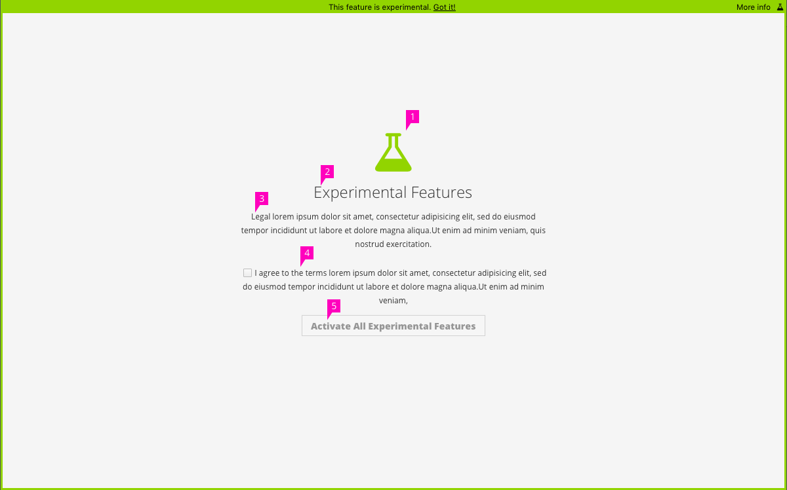
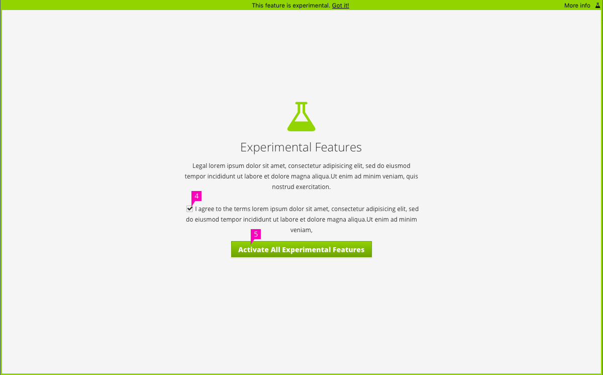
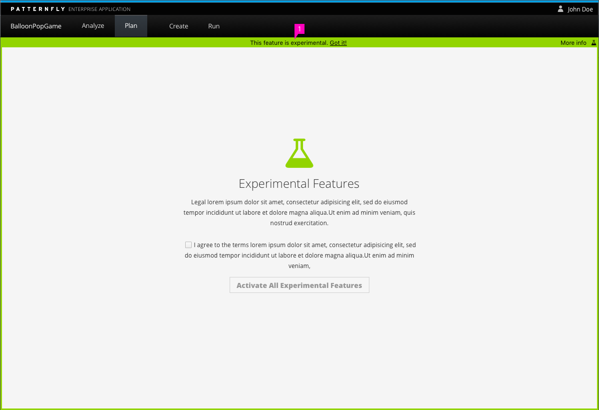
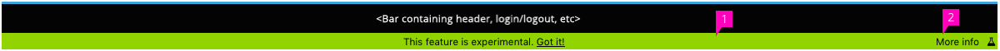
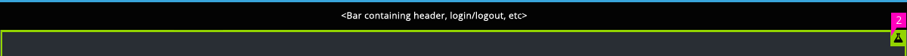

# Experimental Features

## Entry Screen

1. **Icon:** We utilize the flask icon to represent an experiment. The same icon is also used as a flag to show that either a page or a specific feature is considered experimental.
2. **Title:** The title is given as "Experimental Features", but can be changed depending upon project requirements.
3. **Text:** This text should state what the experimental feature entails, as well as any information that you want to present to the user. We recommend that, at a minimum, you give a warning around an experimental feature.
4. **Agreement:** Add a checkbox with text that states the user agrees to use the experimental feature, with guidelines and/or warnings as stated in the above paragraph.
5. **Primary Action Button:** The primary action is displayed in a disabled state until the user accepts the agreement for using an experimental feature. Once that checkbox has been checked, the button transitions to a green button with white text.

## Entry Screen in Context

1. **Placement:** The experimental feature bar and border are place around the content of the screen, even after the user has activated the particular experimental feature. It is designed to clearly delineate the differences between an experimental and non-experimental feature.
    - Any navigational items are still displayed, so that a user can leave the experimental features screen without having the make a decision on accepting the agreements.

## Experiment Features Action Bar

The Action Bar is made up of two action items: "Got it!" and "More info".

1. **Got it!:** The "Got it!" text is a button link that is used to minimize the action bar.
    - Optional: If you always want the bar to be displayed with the "This feature is experimental" text, you can remove the "More info" button and action.

2. **More Info:** The "More info" button is utilized to see additional information on the experimental feature that the user is attempting to utilize.
    - When the bar in minimized, the flask that resides on the right will remain a button, allowing the user to see additional information on experimental features (if applicable) at any time that they wish.
