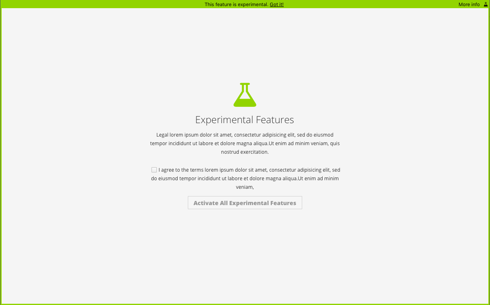
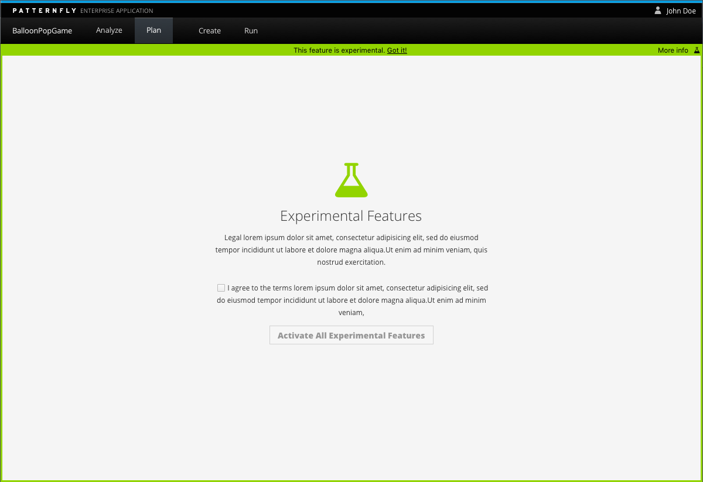

# Experimental Features

The goal of the experimental features pattern is to provide a notice to the user that they are entering an area of the application that may not be finished and is not considered to be the final release. Experimental Features are often items that, while still in progress, are released for use in order to collect information from users, as well as experiment with different patterns, interactions, visuals and development methods. An experimental feature flag is especially useful when you wish to test out alpha or beta features in a production environment, with real users.

This pattern should NOT be used when:

- You do not plan to ever remove the feature flag. Experimental Features are items that you are experimenting with, but will eventually become full features of your application.
- As a permission model. Permission are a separate pattern, usually based off of the [Empty State](www.patternfly.org/pattern-library/communication/empty-state/).
- As a blank page. Users should be able to navigate out of the experimental feature screen to any other part of the application with ease.

The experimental feature pattern is most often used inside of an element, such as a [horizontal](http://www.patternfly.org/pattern-library/navigation/horizontal-navigation/) or [vertical](http://www.patternfly.org/pattern-library/navigation/vertical-navigation/) navigation.

